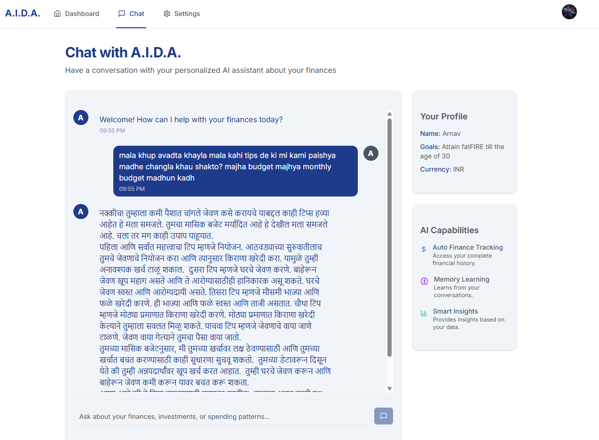
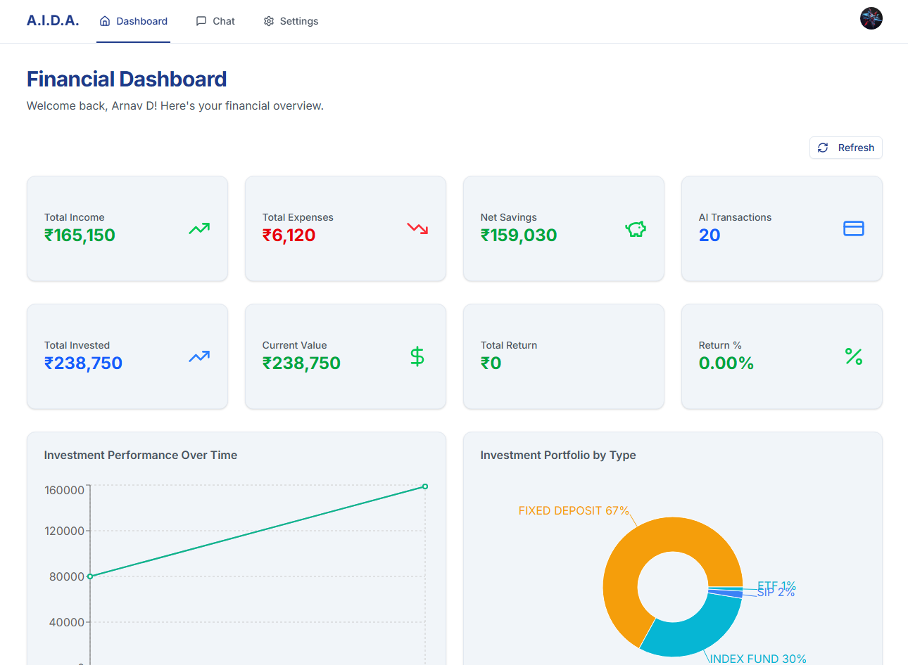

# A.I.D.A. - AI-Driven Account Aggregator

# Play with A.I.D.A yourself - https://aida-sebi-hack.vercel.app

## The Problem: The Advisory Gap

There are over **18 crore demat accounts** in India, but only **1,300 registered advisors** to guide them. This isn't just a gap; it's a **crisis of guidance**.

Millions of Indians are navigating complex financial decisions without proper guidance:
- Young professionals making their first investments
- Families planning for education and retirement
- Small business owners managing cash flow
- Senior citizens protecting their life savings

The traditional advisory model is fundamentally broken - it's expensive, inaccessible, and doesn't scale to serve India's massive population.

## The Inflection Point: Why Now?

Enter the **Account Aggregator framework** - the game-changing technology that makes this vision possible.

For the first time, with a user's consent, we can get a **complete, secure, and real-time view** of their entire financial life:
- **Bank accounts** across all institutions
- **Investment portfolios** from multiple brokers
- **Insurance policies** and claims history
- **Credit card statements** and spending patterns
- **Loan details** and repayment schedules

This was **impossible yesterday**. It is **possible today** through RBI's Account Aggregator framework, creating the perfect foundation for AI-powered financial guidance.

## The Solution: Project A.I.D.A.

**A.I.D.A.** (AI-Driven Account Aggregator) is India's first hyper-personalized AI financial advisor that understands you completely.

### Live Interactive Demo

Imagine you're a 28-year-old software engineer with a ₹50,000 monthly salary. You just received a ₹2 lakh bonus and you're wondering what to do with it.

**You:** "I just got a ₹2 lakh bonus. What should I do with it?"

**A.I.D.A.:** "Congratulations on your bonus! Based on your financial profile, I can see you've been consistently saving 20% of your salary and have ₹3 lakh in your HDFC savings account. You also have a SIP of ₹10,000/month in mutual funds and a PPF account.

Here's what I'd recommend for your ₹2 lakh bonus:

1. **Emergency Fund (₹50,000)**: Top up your emergency fund to 6 months of expenses
2. **Debt Reduction (₹50,000)**: Pay off your remaining credit card balance
3. **Long-term Investment (₹1 lakh)**: Invest in a balanced advantage fund for 3-5 year horizon

This aligns with your moderate risk profile and gives you ₹15,000 annual tax savings under 80C.

Would you like me to help you execute any of these recommendations?"

## Key Features

### AI-Powered Conversations

Natural language processing in **12 Indian languages** with context-aware responses based on your complete financial history.


### Vernacular Language Support

Full support for regional languages including Hindi, Tamil, Telugu, Bengali, Marathi, Gujarati, and more.



### Comprehensive Financial Dashboard

Real-time portfolio tracking across all investments with automated expense categorization and budgeting.




### Live AI Activity

Auto-detects transactions from conversations and updates investment values when you mention changes.


### Investment Management

Complete investment portfolio monitoring with performance analytics and AI-driven insights.


### Memory Management

Long-term financial preference learning and personalized recommendations based on your financial history.


### SEBI Compliant & Secure

Built on **Account Aggregator framework** for secure data access with zero data storage - all processing happens in real-time with end-to-end encryption.

## The Vision: A Category-Defining Unicorn

A.I.D.A. is not just a hackathon project; it is the **foundation for a category-defining unicorn**.

### The Market Opportunity
- **18 crore demat accounts** represent a ₹2 lakh crore TAM
- **Growing at 15% CAGR** with increasing digital adoption
- **Massive underserved market** with only 1,300 advisors

### The Technology Advantage
- **First-mover advantage** in Account Aggregator + AI space
- **Scalable architecture** built on Google Cloud + Firebase
- **Multi-language support** for pan-India adoption
- **API-first design** for seamless integrations

### The Impact

A.I.D.A. will **democratize financial advice** in India by:
- Making professional guidance accessible to everyone
- Reducing financial illiteracy through AI education
- Preventing costly mistakes through proactive insights
- Creating wealth-building opportunities for underserved communities

## Technology Stack

- **Frontend**: Next.js 14, TypeScript, Tailwind CSS
- **Backend**: Firebase (Firestore, Auth, Functions)
- **AI Engine**: Google Gemini 1.5 Flash
- **Data Visualization**: Recharts
- **State Management**: SWR for real-time updates
- **Security**: Firebase Security Rules, JWT tokens

## If you want to set up A.I.D.A locally

### Prerequisites
- Node.js 18+
- npm or pnpm
- Firebase project with Firestore enabled
- Google Gemini API key

### Installation

1. Clone the repository
```bash
git clone https://github.com/delbyte/aida-sebi-hack.git
cd aida-sebi-hack
```

2. Install dependencies
```bash
pnpm install
```

3. Set up environment variables
```bash
cp .env.example .env.local
# Add your Firebase config and Gemini API key
```

4. Run the development server
```bash
pnpm dev
```

## Project Structure

```
├── app/                    # Next.js app router
│   ├── api/               # API routes
│   ├── dashboard/         # Main dashboard
│   └── chat/              # AI chat interface
├── components/            # Reusable UI components
├── lib/                   # Utility functions and AI parsers
├── models/                # TypeScript interfaces
└── hooks/                 # Custom React hooks
```

## Key Components

- **AI Chat System**: Natural language processing with financial context
- **Investment Tracker**: Real-time portfolio monitoring and updates
- **Expense Analyzer**: Automated categorization and budgeting
- **Memory System**: Long-term financial preference learning
- **Account Aggregator Integration**: Secure multi-institution data access

---

**A.I.D.A.** - Transforming India's financial landscape, one conversation at a time.
